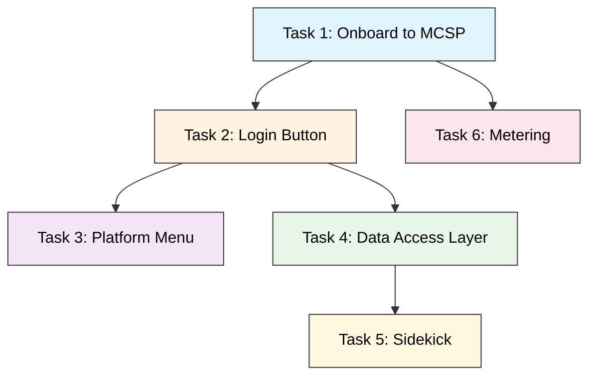

The Platform consists of three elements that augment the user experience of any product.


These are:

1. The login button
2. The Platform Menu
3. The Sidekick

Example code to back these elements are available by cloning this repo.

```shell
git clone git@github.acme.com:srajagopalan/how-to-platform.git
```

You can also use our language bindings to import this code directly into your project if you
are working in either TypeScript or Golang. If you wish to contribute bindings for any other language, please reach out!

In order to integrate these three elements into your user experience, you need to perform 6 tasks. This repo
contains a "How To" guide for each of the 6 tasks as well as example code in TypeScript and Golang. You are welcome
to use the example code in your projects (copy and paste things you need). All the code herein is authored by Acmers and therefore
are available to use.

1. Onboard to [MCSP user management](task-1-onboard-mcsp)
1. Implement the [Login Button](task-2-login-button)
1. Embed the [platform menu](task-3-platform-menu)
1. Implement the standardized data access layer. For sidekick widgets the REST/GraphQL Interface is required. For agentic chat only the MCP Service is required. You can choose to implement either one, or both.
    1. [MCP Service](task-4a-mcp-service)
    1. [REST/GraphQL Interface](task-4b-data-access-config)
1. Embed the [sidekick](task-5-sidekick)
1. Implement [metering](task-6-implement-metering)

Before you start, it might help to read about [work with MCSP](working-with-mcsp).

## Task Dependencies

The tasks have the following dependencies:



## Code Examples

If you would rather read code, then look into the examples depending on your language of choice:

- **[TypeScript Examples](examples/typescript/)** - Node.js project with npm dependencies
- **[Go Examples](examples/go/)** - Go project with go.mod setup
